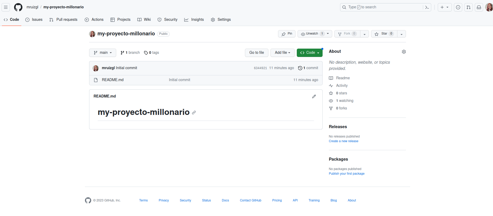
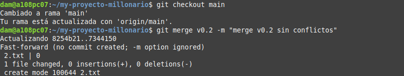
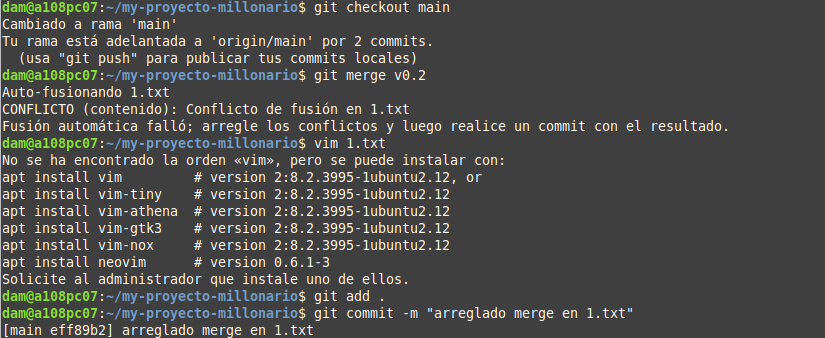

<div>

# Manipulación avanzada en git (trabajo con tags y ramas)
## Alumna: Melissa Ruiz González

Vamos a crear un repositorio en GitHub que se llame "my-proyecto-millonario" https://github.com/mruizgl/my-proyecto-millonario
- Creamos repositorio


- Clonamos repositorio en Git
  


- Hacemos un commit inicial


__Pregunta:__ Si has clonado el repostorio es necesirio que parte del comando anterior puedo omitir.Justifica tu respuesta en el fichero README.md.
<details>
  <summary>PULSA PARA VER LA RESPUESTA:</summary>
El commit inicial puesto que ya se hace al crearlo al igual que añadí el readme automáticamente.

</details>

- Subimos los cambios al repositorio remoto utilizando
```
git push origin main
```


- Crear en el repositorio local un fichero llamado __privado.txt__ y una carpeta llamada __privada__. Realizar los cambios oportunos para que tanto el archivo como la carpeta sean ignorados por git.


__Pregunta:__ el fichero y el directorio privado debe de subir al repositorio si se encuentra añadido al fichero .gitingnore. [Si/No]. Justifica tu respuesta en el fichero README.md.


<details>
  <summary>PULSA PARA VER LA RESPUESTA:</summary>
No, el fichero y el directorio privado no deben subirse al repositorio si se encuentran añadidos al archivo .gitignore.

El archivo .gitignore se utiliza para especificar los archivos y directorios que deben excluirse del control de versiones y, por lo tanto, no deben subirse al repositorio Git.

</details>

## Añadir fichero 1.txt y añadir un tag v.0.1
- Añadir fichero 1.txt al repositorio local.
```
touch 1.txt
git add .
git commit -m "añadido 1.txt"
```
__Pregunta:__ Si ejecutado las acciones add y commit, que realiza cada una sobre el/los ficheros. Justifica tu respuesta en el fichero README.md.
<details>
  <summary>PULSA PARA VER LA RESPUESTA:</summary>
git add .: Agrega todos los archivos modificados y nuevos al área de preparación.  git commit toma esos cambios preparados y crea un nuevo commit en la historia del repositorio con un mensaje descriptivo. 


</details>

- Crear un tag v0.1.
- Subir los cambios al repositorio remoto.


## Crear una rama v0.2
- Crear una rama v0.2.
```
git branch v0.2
```
- Posiciona tu carpeta de trabajo en esta rama.
```
git checkout v0.2
```


## Añadir fichero 2.txt
- Añadir un fichero 2.txt en la rama v0.2.


__Pregunta__ Cuando estamos trabajando con ramas, cual es su fin, y sentido en organizaciones pequeñas/medianas/grandes. Justifica tu respuesta en el fichero README.md.
<details>
  <summary>PULSA PARA VER LA RESPUESTA:</summary>
Propósito de las ramas:
Las ramas en Git tienen los siguientes propósitos generales:

Desarrollo paralelo: Permiten a los equipos de desarrollo trabajar en múltiples características o problemas al mismo tiempo sin interferirse mutuamente.

Experimentación y pruebas: Las ramas pueden utilizarse para probar nuevas características, soluciones o ideas sin afectar la rama principal del proyecto.

Mantenimiento y corrección de errores: Las ramas facilitan la corrección de errores y el mantenimiento a largo plazo del proyecto sin interrupciones en el desarrollo principal.

Gestión de versiones: Ayudan a gestionar versiones específicas del software o del proyecto, lo que es útil para liberar versiones estables.
Tamaño de organizaciones
Organizaciones Pequeñas:

Justificación: En organizaciones pequeñas, las ramas son útiles para facilitar la colaboración entre un pequeño número de desarrolladores. Permiten una gestión más efectiva de las características y los problemas a medida que evolucionan.
Uso: Las ramas pueden utilizarse para aislar nuevas funcionalidades o experimentos, y para corregir errores de manera ordenada. También permiten a los equipos mantener un flujo de trabajo limpio y establecer un proceso de revisión de código.
Organizaciones Medianas:

Justificación: En organizaciones medianas, el uso de ramas se vuelve aún más crítico a medida que aumenta la complejidad del proyecto y la cantidad de desarrolladores involucrados. Ayudan a evitar conflictos y a garantizar un desarrollo más controlado.
Uso: Además de los usos anteriores, las ramas se utilizan para gestionar la implementación de nuevas características, realizar pruebas exhaustivas y facilitar la colaboración entre equipos o departamentos.
Organizaciones Grandes:

Justificación: En organizaciones grandes, las ramas son fundamentales para mantener un flujo de trabajo eficiente y evitar el caos en el desarrollo. Ayudan a coordinar a grandes equipos de desarrollo y a mantener la estabilidad del proyecto.
Uso: Se utilizan para la gestión de múltiples equipos, la implementación de cambios significativos y la realización de pruebas exhaustivas. También son esenciales para el mantenimiento a largo plazo y la gestión de versiones.


</details>

## Crear rama remota v0.2
- Subir los cambios al reposiorio remoto.
```
git push origin v0.2
```


## Merge directo
- Posicionarse en la rama master/main según sea tu rama principal y hacer un merge de la rama v0.2 en la rama master/main.


## Merge con conflicto
- En la rama maste/main poner Hola en el fichero 1.txt y hacer commit.
```
git checkout master
echo "Hola" >> 1.txt
git add .
git commit -m "hola en 1.txt"
```


- Posicionarse en la rama v0.2 y poner Adios en el fichero "1.txt" y hacer commit.


- Posicionarse de nuevo en la rama main y hacer un merge con la rama v0.2


## Listado de ramas
- Listar las ramas con merge y las ramas sin merge.
```
git branch --merged
git branch --no-merged
```
## Arreglar conflicto 
- Arreglar el conflicto anterior y hacer un commit.
```
vim 1.txt
git add .
git commit -m "arreglado merge en 1.txt"
```


## Borrar rama
- Crear un tag v0.2
```
git tag v0.2
```
- Borrar la rama v0.2
```
git branch -d v0.2
```


## Listado de cambios 
- Listar los distintos commits con sus ramas y sus tags.
```
git config --global alias.list 'log --oneline --decorate --graph --all'
git list
```


- Por último hago push de todo a main con git push origin main para que se actualice en el repositorio remoto todos los cambios que hemos hecho desde el último push.
</div>
