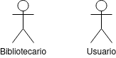
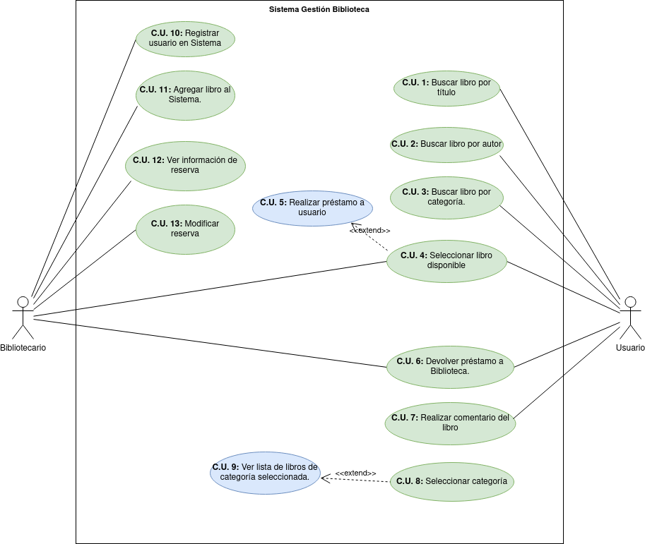

## Diagrama de casos de Uso

Lo primero que haremos para documentar este proyecto será un diagrama de Casos de uso.  
El diagrama de Casos de Uso es una práctica común dentro de las metodologías ágiles del modelo UML (Unified Modelling Language)
y nos sirve para de forma conceptual tener claros los casos de uso que tendrá el sistema.

## Actores

*Se le llama actor a toda entidad externa al sistema que guarda una relación con este y 
que le demanda una funcionalidad.*    

En este Proyecto podemos definir dos actores:  

  

|  Actor | Bibliotecario                                                                             |
|---|-------------------------------------------------------------------------------------------|
| Descripción  | _Un individuo que busca servicios médicos en el hospital._                                |
| Características  | _Paciente del hospital del que es parte nuestro sistema_                                  |
| Relaciones | _Programa citas (C.U 2) al igual que el actor Recepcionista._                             |
| Referencias | _C.U. 1, C.U. 2_                                                                          |   
|  Notas | _Al darse de alta debe añadir su información personal y puede añadir información médica._ |
| Autor  | _Melissa Ruiz_                                                                            |
|Fecha | _15/11/2023_                                                                              |

|  Atributo |||
|---|---|---|
| _Nombre_  | _Nombre del paciente_  | _String_ |
| _Apellido1_  | _Primer apellido del paciente_  | _String_ |
| _Apellido2_  | _Segundo apellido del paciente_  | _String_ |
| _Edad_  | _Edad del paciente_  | _int_ |
| _Información médica_  | _Información médica del paciente (antecedentes, alergias...)_  | _String_ |
| | |

-------------

|  Actor | Usuario                                                                           |
|---|-----------------------------------------------------------------------------------|
| Descripción  | _Profesional médico encargado de diagnosticar y tratar a los pacientes_           |
| Características  | _Realiza diagnósticos, prescribe tratamientos, asigna tareas a los enfermeros..._ |
| Relaciones | _Tiene relación con el actor Enfermero._                                          |
| Referencias | _C.U. 4, C.U. 14, C.U. 5, C.U. 8, C.U. 3, C.U. 10_                                |   
|  Notas |                                                                                   |
| Autor  | _Melissa Ruiz_                                                                    |
|Fecha | _15/11/2023_                                                                      |

|  Atributo |                                                               ||
|---|---------------------------------------------------------------|---|
| _Nombre_  | _Nombre del Usuario_                                          | _String_ |
| _Apellido1_  | _Primer apellido del paciente_                                | _String_ |
| _Apellido2_  | _Segundo apellido del paciente_                               | _String_ |
| _Edad_  | _Edad del paciente_                                           | _int_ |
| _Información médica_  | _Información médica del paciente (antecedentes, alergias...)_ | _String_ |
| |                                                               |

------------------

### Casos de Uso
- __C.U. 1:__ Buscar libro por título.
- __C.U. 2:__ Buscar libro por autor.
- __C.U. 3:__ Buscar libro por categoría.
- __C.U. 4:__ Seleccionar libro disponible.
- __C.U. 5:__ Realizar préstamo a usuario.*
- __C.U. 6:__ Devolver préstamo a Biblioteca. *
- __C.U. 7:__ Realizar comentario del libro.
- __C.U. 8:__ Seleccionar categoría.
- __C.U. 9:__ Ver lista de libros de categoría elegida.
- __C.U. 10:__ Registrar usuario en sistema.
- __C.U. 11:__ Agregar libro al sistema.
- __C.U. 12:__ Ver información de reserva.
- __C.U. 13:__ Modificar reserva.
### Diagrama de Casos de Uso final

