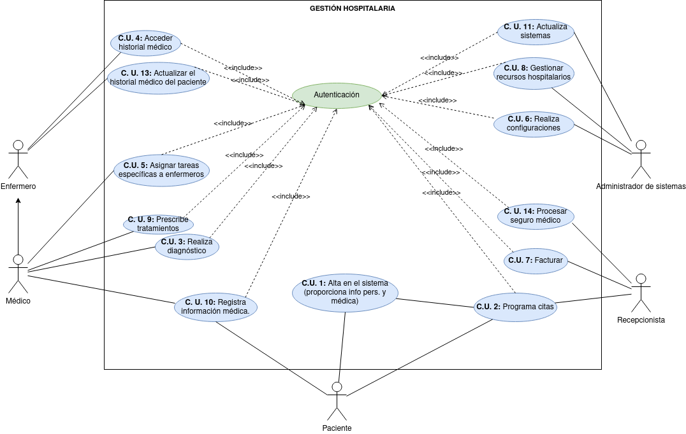

## Diagrama C.U.

En función de la información que nos han proporcionado hemos realizado un diagrama de Casos de Uso para que se pueda tener una visión de lo que será el sistema de Gestión Hospitalaria, esto sirve para tener una idea ordenada y organizada del programa que vamos a desarrollar, una buena práctica dentro de las famosas metodologías ágiles:

### Actores

|  Actor | Paciente |
|---|---|
| Descripción  | _Un individuo que busca servicios médicos en el hospital._  |
| Características  | _Paciente del hospital del que es parte nuestro sistema_ |
| Relaciones | _Programa citas (C.U 2) al igual que el actor Recepcionista._  |
| Referencias | _C.U. 1, C.U. 2_ |   
|  Notas |  _Al darse de alta debe añadir su información personal y puede añadir información médica._ |
| Autor  | _Melissa Ruiz_ |
|Fecha | _15/11/2023_ |

|  Atributo |||
|---|---|---|
| _Nombre_  | _Nombre del paciente_  | _String_ |
| _Apellido1_  | _Primer apellido del paciente_  | _String_ |
| _Apellido2_  | _Segundo apellido del paciente_  | _String_ |
| _Edad_  | _Edad del paciente_  | _int_ |
| _Información médica_  | _Información médica del paciente (antecedentes, alergias...)_  | _String_ |
| | |

-------------

|  Actor | Médico |
|---|---|
| Descripción  | _Profesional médico encargado de diagnosticar y tratar a los pacientes_  |
| Características  | _Realiza diagnósticos, prescribe tratamientos, asigna tareas a los enfermeros..._ |
| Relaciones | _Tiene relación con el actor Enfermero._  |
| Referencias | _C.U. 4, C.U. 14, C.U. 5, C.U. 8, C.U. 3, C.U. 10_ |   
|  Notas |   |
| Autor  | _Melissa Ruiz_ |
|Fecha | _15/11/2023_ |

------------------

|  Actor | Enfermero                                                      |
|---|----------------------------------------------------------------|
| Descripción  | _Encargado de asistir a los médicos y cuidar a los pacientes._ |
| Características  | _Encargado de asistir a los médicos y cuidar a los pacientes._ |
| Relaciones | _Tiene relación con el actor Médico._                          |
| Referencias | _C.U. 4, C.U. 13_                                              |   
|  Notas |                                                                |
| Autor  | _Melissa Ruiz_                                                 |
|Fecha | _15/11/2023_                                                   |

|  Actor | Administrador del Sistema                                     |
|---|---------------------------------------------------------------|
| Descripción  | _Responsable de la configuración y administración del sistema._ |
| Características  | _Responsable de la configuración y administración del sistema._ |
| Relaciones |                                                               |
| Referencias | _C.U. 11, C.U. 8, C. U. 6_                                    |   
|  Notas |                                                               |
| Autor  | _Melissa Ruiz_                                                |
|Fecha | _15/11/2023_                                                  |

|  Actor | Recepcionista                                                   |
|---|-----------------------------------------------------------------|
| Descripción  | _Encargado de la recepción de pacientes y asignación de citas._ |
| Características  | _Encargado de la recepción de pacientes y asignación de citas._ |
| Relaciones | _Relación con Paciente en el C.U 2_                             |
| Referencias | _C.U. 2, C.U. 7, C. U. 14_                                      |   
|  Notas |                                                                 |
| Autor  | _Melissa Ruiz_                                                  |
|Fecha | _15/11/2023_                                                    |

## Modelo final C.U.

